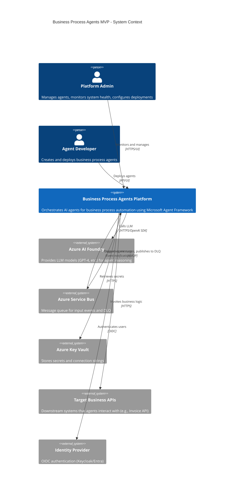
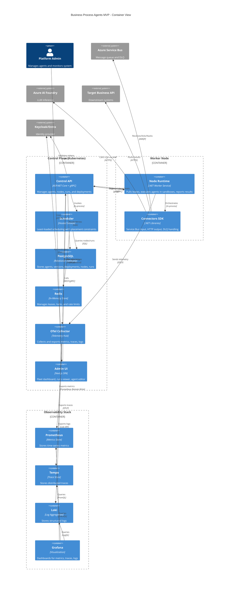
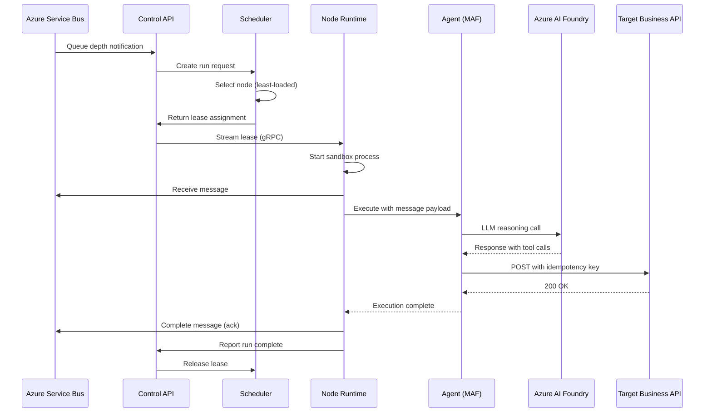
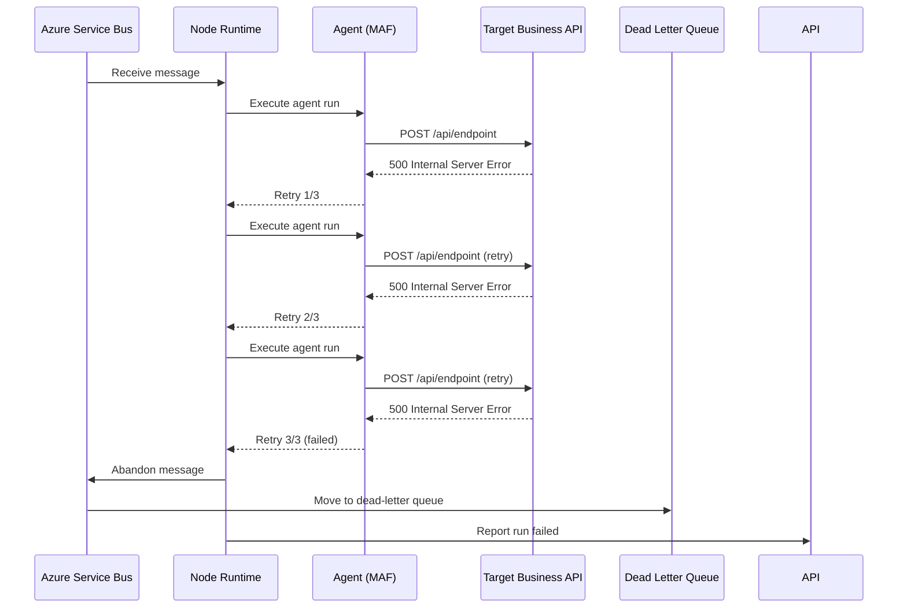
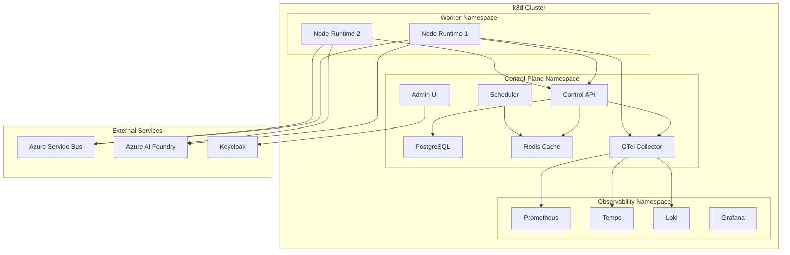
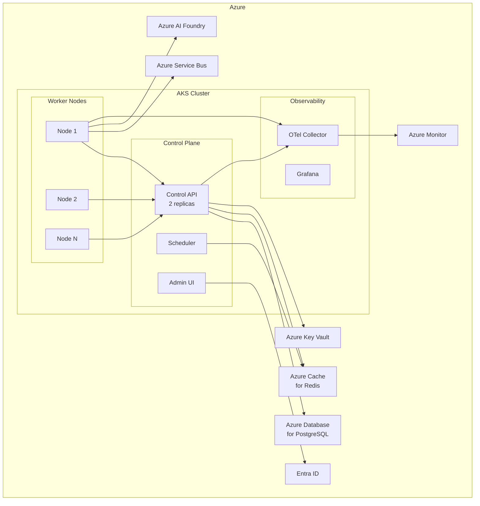

# Architecture Diagrams

This document contains C4 architecture diagrams for the Business Process Agents MVP system.

## Overview

The C4 model provides a hierarchical view of the system architecture:
- **Context**: System context and external dependencies
- **Container**: High-level technology choices and container interactions

---

## C4 Context Diagram

The context diagram shows how the Business Process Agents platform fits into the broader enterprise ecosystem, including external actors and systems.

**Key External Dependencies:**

- **Azure AI Foundry**: Hosts LLM models (e.g., GPT-4) used by agents for reasoning and decision-making via Microsoft Agent Framework
- **Azure Service Bus**: Input queue for business events (invoices, orders, etc.) and dead-letter queue for failed messages
- **Azure Key Vault**: Secure storage for connection strings, API keys, and certificates
- **Target Business APIs**: External REST APIs that agents call to perform business actions (e.g., creating invoices, updating records)
- **Identity Provider**: OIDC provider for admin/developer authentication (Keycloak for dev, Entra for production)

---

## C4 Container Diagram

The container diagram shows the internal structure of the Business Process Agents platform, including key components and their interactions.

**Key Containers:**

### Control Plane
- **Control API**: REST and gRPC endpoints for managing agents, nodes, and runs; integrates with Microsoft Agent Framework SDK
- **Scheduler**: Selects optimal node for each run based on capacity and placement constraints
- **PostgreSQL**: Persistent storage for all system state
- **Redis**: Distributed locks and lease management with TTL
- **OTel Collector**: Central telemetry aggregation point
- **Admin UI**: Web interface for operators and developers

### Worker Node
- **Node Runtime**: Long-running worker service that pulls leases, executes agents via MAF, and reports status
- **Connectors SDK**: Pluggable input/output adapters (Service Bus, HTTP, DLQ)

### Observability Stack
- **Prometheus**: Metrics storage and querying (runs, latency, tokens, cost)
- **Tempo**: Distributed tracing backend
- **Loki**: Log aggregation with trace correlation
- **Grafana**: Unified dashboards for all telemetry

---

## Additional Diagrams

### Sequence Diagram: Agent Run Flow

Shows the end-to-end flow of processing a message through an agent run.

### Sequence Diagram: Failure and DLQ Flow

Shows how failures are handled and messages are routed to the dead-letter queue.

---

## Deployment View

### Local Development (k3d)

### Production (AKS)

---

## Technology Stack Summary

| Layer | Technologies |
|-------|-------------|
| **Control Plane** | ASP.NET Core, gRPC, Microsoft Agent Framework SDK |
| **Worker Runtime** | .NET Worker Service, Microsoft Agent Framework |
| **Storage** | PostgreSQL, Redis |
| **Messaging** | Azure Service Bus, NATS JetStream |
| **AI/LLM** | Azure AI Foundry (GPT-4, etc.) |
| **Observability** | OpenTelemetry, Prometheus, Tempo, Loki, Grafana |
| **UI** | Next.js, React, Tailwind CSS, shadcn/ui |
| **Auth** | Keycloak (dev), Entra ID (prod), OIDC |
| **Infrastructure** | Kubernetes (k3d/AKS), Helm, Docker |
| **Secrets** | Azure Key Vault, External Secrets Operator |

---

## References

- [System Architecture Document (SAD)](../sad.md)
- [Microsoft Agent Framework Documentation](https://learn.microsoft.com/en-us/agent-framework/)
- [C4 Model](https://c4model.com/)
- [Azure AI Foundry Integration](./AZURE_AI_FOUNDRY_INTEGRATION.md)
