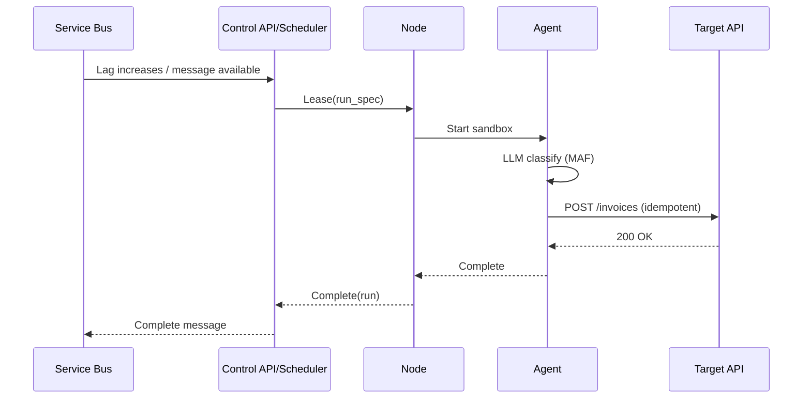

# Business Process Agents – MVP System Architecture Document (SAD)

> Version: 0.1 (MVP)
> Owner: Platform Engineering
> Status: Draft for internal review
> Target date: End of Sprint 3

---

## 1. Purpose

Prove the core concepts of a **business process agents** platform built on the **Microsoft Agent Framework (MAF)** by shipping a minimal yet production‑shaped slice: control plane, node runtime, policy‑based scheduling, and a working agent that processes messages end‑to‑end with observability and guardrails.

**MVP Goals**

* Run a single **Invoice Classifier** agent from queue → LLM/tool calls → API + DLQ.
* Demonstrate **scheduling/placement** and node leasing with backpressure awareness.
* Provide **end‑to‑end observability** (metrics, logs, traces) and basic **cost metering**.
* Expose a small **Admin UI**: fleet health, runs list, basic policy editor.

**Explicit Non‑Goals (MVP)**

* Multi‑tenant workspaces (implement single default workspace)
* Canary rollouts (simple on/off deployment)
* Workflow graphs (single‑agent runs only)
* Complex connectors (ship only Service Bus + HTTP for MVP)

---

## 2. Scope

**In‑scope**: Control API subset, Scheduler (least‑loaded + basic constraints), Node Runtime, Connector SDK (SB in, HTTP out, DLQ), Observability stack, Single agent definition + deployment, CI/CD, k3d + AKS install paths.

**Out‑of‑scope**: GPU scheduling, cost optimization engine, fairness/quotas, egress proxy policies, CRD admission webhooks, multi‑region HA.

---

## 3. High‑Level Architecture (MVP)

```mermaid
C4Container
title MVP – Container View
Container_Boundary(Control, "Control Plane (K8s)") {
  Container(API, "Control API", "ASP.NET + gRPC", "Agents, Nodes, Runs (subset)")
  Container(Sched, "Scheduler", "Library + hosted service", "Least‑loaded + constraints")
  Container(DB, "PostgreSQL", "State", "Agents/Versions/Deployments/Runs")
  Container(Cache, "Redis", "Leases & Locks", "Lease holds, ratelimits")
  Container(Obs, "OTel Collector", "Telemetry", "Export → Prometheus/Tempo/Loki")
  Container(UI, "Admin UI", "Next.js", "Fleet, Runs, Policy editor (MVP)")
}
Container_Boundary(Node, "Worker Node") {
  Container(NodeSvc, "Node Runtime", ".NET Worker", "Lease Pull, sandbox, telemetry")
  Container(Conn, "Connectors", ".NET SDK", "Service Bus in, HTTP out, DLQ")
}
System_Ext(SB, "Azure Service Bus", "Input queue + DLQ")
System_Ext(APIOut, "Target API", "Invoice endpoint")
UI --> API
API --> Sched
API --> DB
Sched --> Cache
NodeSvc --> API: Register/Heartbeat
NodeSvc --> API: gRPC Lease Pull
Conn --> SB: Receive/Ack/Nack
Conn --> APIOut: POST (idempotent key)
NodeSvc --> Obs: Traces/Metrics/Logs
```

---

## 4. Detailed Design (MVP subset)

### 4.1 Control API (subset)

* `POST /v1/nodes:register` – register node
* `POST /v1/lease/pull` (gRPC preferred; REST fallback) – stream leases
* `POST /v1/runs/{id}:complete|fail|cancel`
* `POST /v1/agents` + `:version` – create one agent (invoice-classifier)
* `POST /v1/deployments` – deploy agent (replicas, simple placement labels)

**Storage**: `agents`, `agent_versions`, `deployments`, `nodes`, `runs` tables

### 4.2 Scheduler (MVP)

* Strategy: **least‑loaded with hard constraints** (match region label)
* Inputs: node capacity (slots), active runs per node
* Output: `plan` with `(runId → nodeId)` + TTL lease hold in Redis

### 4.3 Node Runtime

* gRPC `Pull` stream; accepts `Lease { runSpec, deadline }`
* Spawns **sandbox process**; enforces token/time budget from runSpec; graceful cancellation
* Reports progress → complete/fail; retries with exponential backoff (max 3) then DLQ

### 4.4 Connectors (MVP)

* **Input**: Azure Service Bus queue

  * `ReceiveAsync` (prefetch 16), complete/abandon, poison detection → DLQ
* **Output**: HTTP POST with idempotency key (`RunId + InputOffset`)
* **DLQ**: Service Bus DLQ; dead‑letter after 3 failed attempts or deserialization errors

### 4.5 Observability

* **Metrics**: `runs_started_total`, `runs_failed_total`, `run_latency_ms`, `node_slots_used`, `sb_queue_lag`, `http_out_success_rate`, `tokens_in/out`, `usd_cost`
* **Traces**: `receive → plan → lease → think → http.out → complete` (Tempo/Jaeger)
* **Logs**: JSON, correlated via `trace_id` (Loki)
* **Dashboards**: Fleet Health, Queue Lag, Run Latency, Cost/Token

### 4.6 Security

* OIDC (dev: Keycloak; prod: Entra) for UI/API
* mTLS for gRPC node links (K8s: service mesh or secret‑mounted certs)
* External Secrets Operator → Azure Key Vault for SB connection + API key

---

## 5. Data Model (MVP Physical)

* `agents(agent_id pk, name, instructions text, model_profile jsonb)`
* `agent_versions(agent_id, version, spec jsonb, created_at, unique(agent_id, version))`
* `deployments(dep_id pk, agent_id, version, env, target jsonb, status jsonb)`
* `nodes(node_id pk, metadata jsonb, capacity jsonb, status jsonb, heartbeat_at)`
* `runs(run_id pk, agent_id, version, dep_id, node_id, input_ref jsonb, status, timings jsonb, costs jsonb, trace_id, created_at)`

---

## 6. Example Agent (MVP)

**Invoice Classifier**

* **Input**: `sb://bpa-mvp/invoices`
* **Instructions**: classify vendor + route
* **Tools**: HTTP call to `https://api.example.com/invoices` (idempotent)
* **Outputs**: API (success), DLQ (failure)
* **Budgets**: `maxTokens=4000`, `maxDuration=60s`

**Deployment**

```json
{
  "agentId": "invoice-classifier",
  "version": "1.0.0",
  "environment": "dev",
  "target": { "slotBudget": 4, "resources": {"cpu":"500m","memory":"1Gi"} },
  "placement": { "affinity": { "region": ["aus-east"] } }
}
```

---

## 7. Flows (MVP sequences)



**Failure path → DLQ**

* Any non‑retryable error → Abandon → SB DLQ
* Retryable (HTTP 5xx) up to 3 times with jitter

---

## 8. NFRs (MVP targets)

* **Throughput**: ≥ 50 runs/min sustained on a single node
* **Placement latency**: p95 < 100 ms
* **End‑to‑end latency**: p95 < 2 s (excluding downstream API latency)
* **Availability**: control plane 99.5% (dev/staging), node runtime restart‑safe
* **Security**: secrets only in AKV; mTLS on node links; RBAC for UI

---

## 9. Environments & Deployment

* **Local**: k3d with Helm: Postgres, Redis, OTel, Loki/Prom/Tempo, Control API, Node, UI
* **Cloud (AKS)**: same chart; ESO → AKV; managed PG optional; Azure Monitor exporter

**Helm values (excerpt)**

```yaml
control:
  replicas: 2
  postgres:
    host: pg
    database: bpa
node:
  replicas: 2
  slotCapacity: 8
connectors:
  serviceBus:
    connectionRef: akv://sb-conn
  httpOut:
    baseUrl: https://api.example.com
observability:
  enabled: true
```

---

## 10. Test Strategy (MVP)

* **Unit**: connectors, scheduler scoring, API controllers (xUnit/NUnit)
* **Integration**: Testcontainers → PG/Redis/SB emulator (Azurite for SB‑like; or real SB in dev sub)
* **E2E**: k3d pipeline job publishes 100 synthetic invoices → expect ≥ 95% success, p95 < 2s
* **Chaos (light)**: kill one node; verify leases reassign within TTL

**Acceptance Criteria**

1. A message sent to `invoices` results in a POST to target API with correct payload.
2. Failure with 5xx retries 3 times then DLQs.
3. Metrics, logs, and traces visible in Grafana with run_id correlation.
4. UI shows nodes, active runs, last 100 runs with status.

---

## 11. Risks & Mitigations (MVP)

| Risk                 | Likelihood | Impact | Mitigation                                      |
| -------------------- | ---------- | ------ | ----------------------------------------------- |
| SB emulator mismatch | Medium     | Medium | Use real SB in dev subscription                 |
| Connector timeouts   | Medium     | Medium | Reasonable timeouts + retries + circuit breaker |
| Cost surprises       | Low        | Medium | Token/duration budgets; synthetic load tests    |
| Leases double‑assign | Low        | High   | Redis lease holds with TTL; idempotency keys    |

---

## 12. Operational Runbooks (MVP)

* **Drain a node**: set `drain=true` → wait → cordon → restart
* **Rotate secrets**: update AKV, ESO refresh → nodes restart connectors
* **Replay DLQ**: SB `deadletter` → fix → move to `invoices` with `x-replayed=true`

---

## 13. Backlog to Post‑MVP

* Canary/blue‑green rollouts
* Workspaces/tenancy
* Fairness quotas + token budgets per tenant
* Additional connectors (Kafka, SQS, Blob, SQL)
* Policy packs (egress allow‑list, redaction)
* Workflow graphs & fan‑out/fan‑in

---
